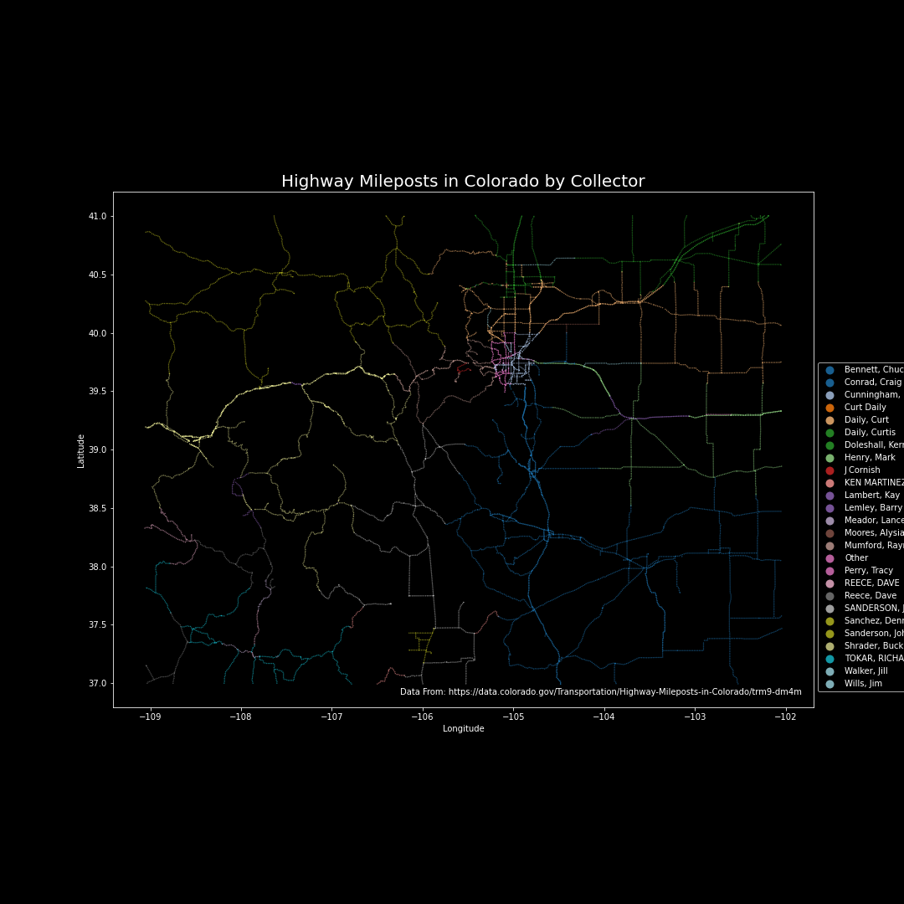
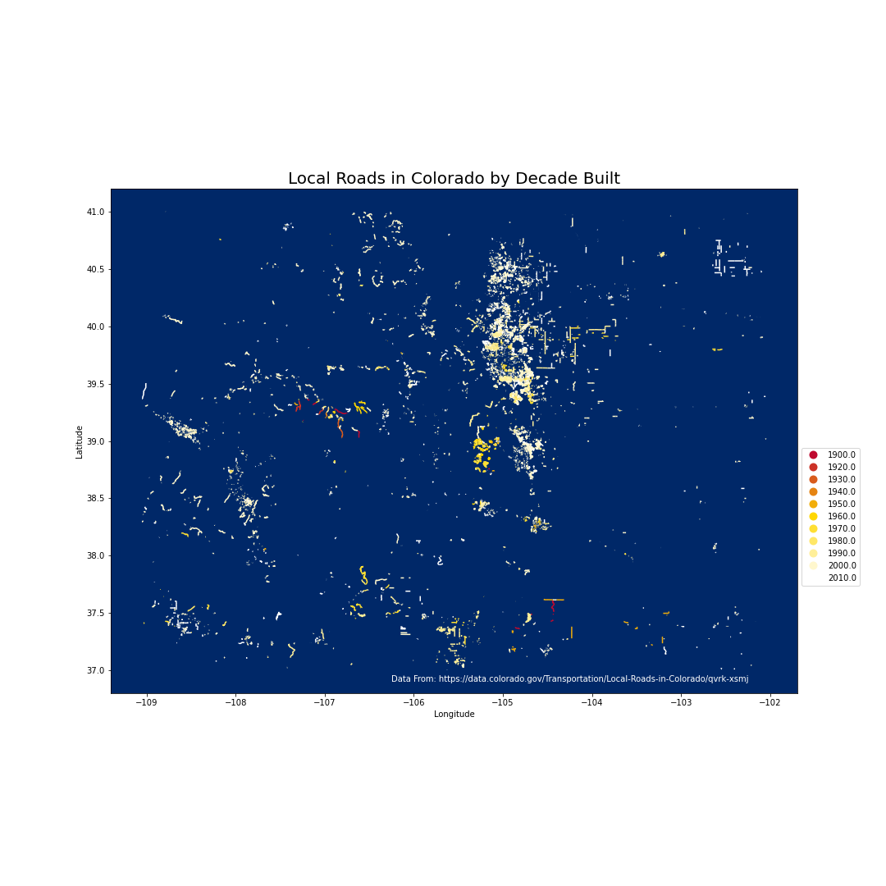
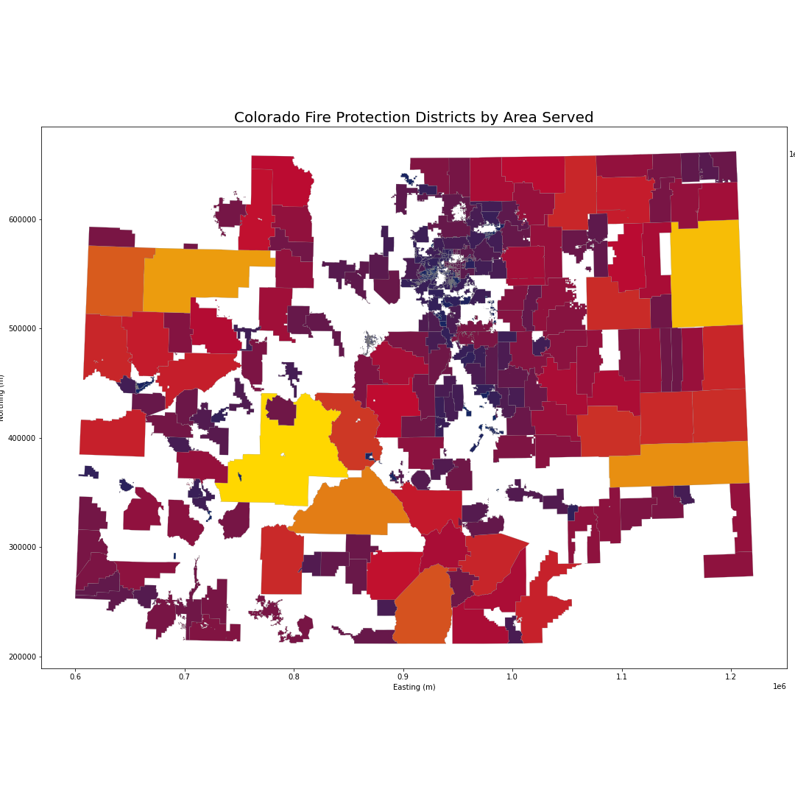
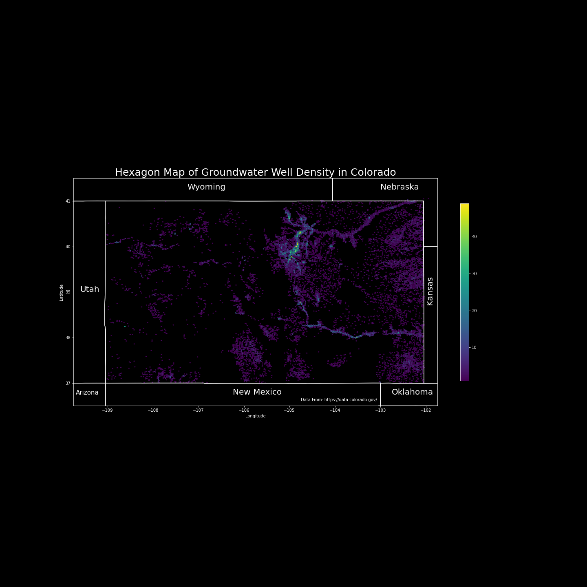
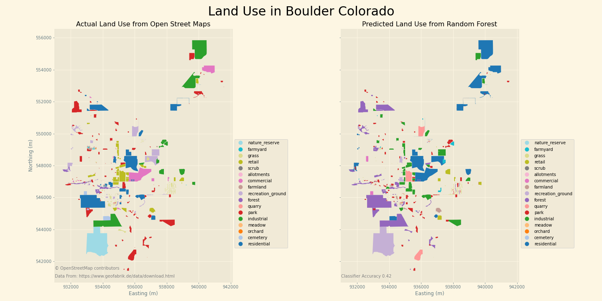
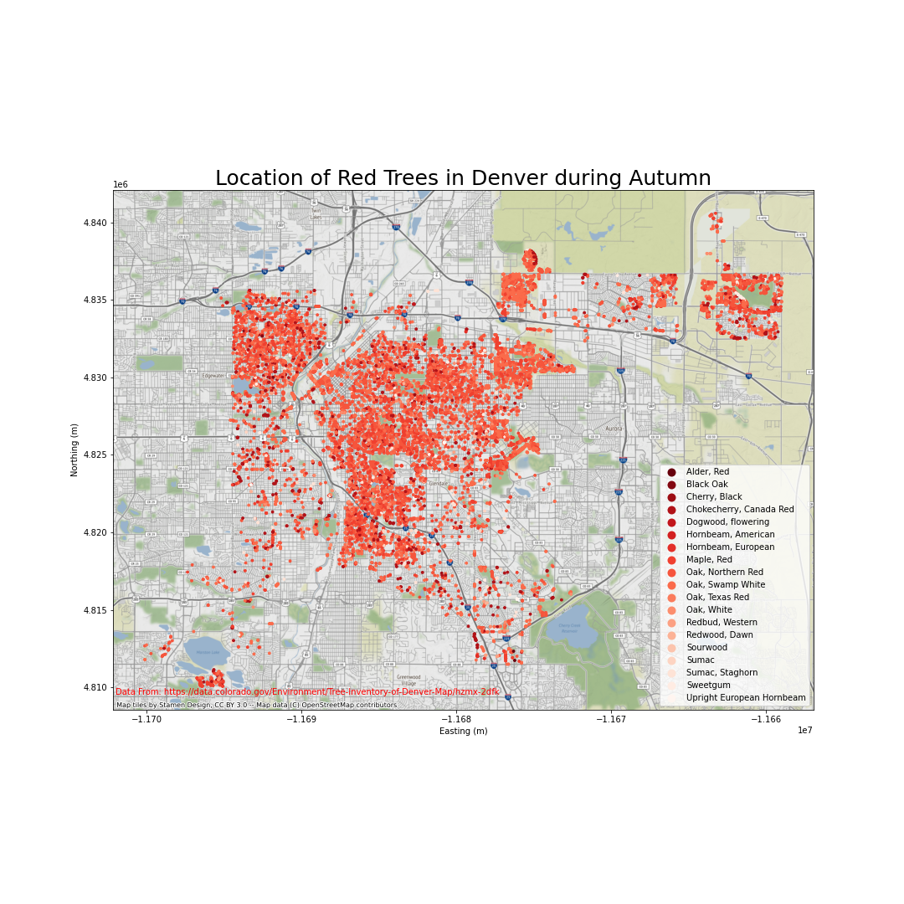
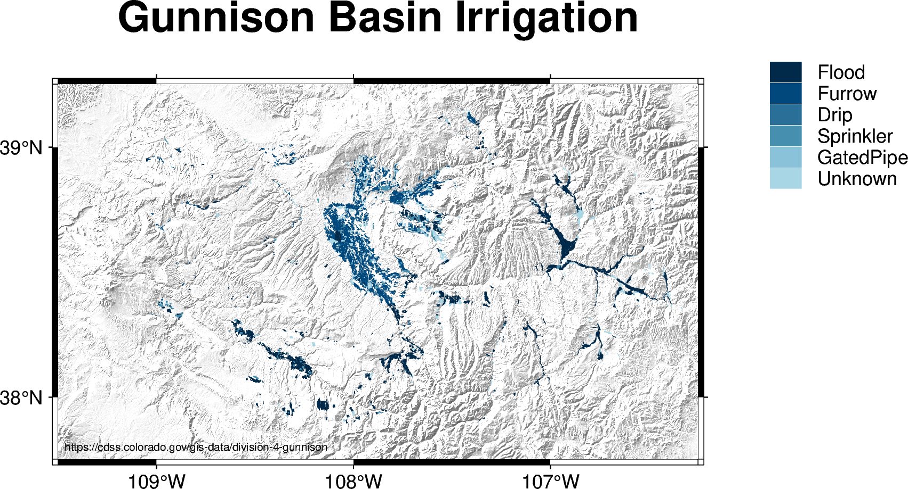
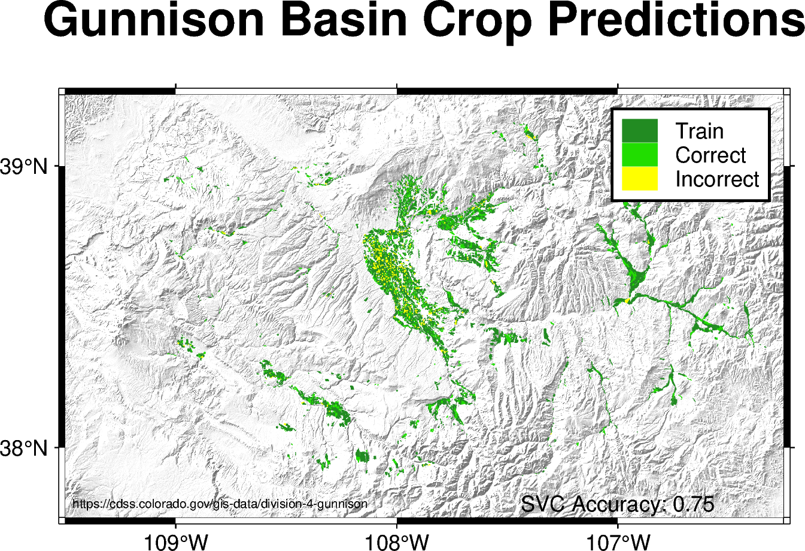
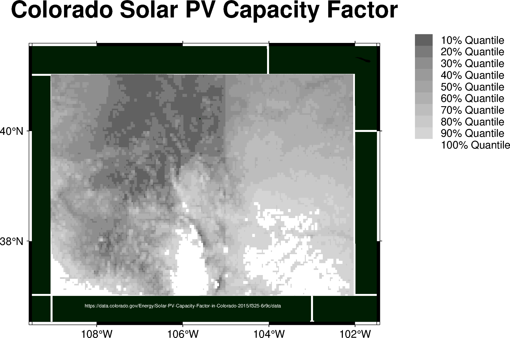

# 30daymapchallenge_21
Repository for my 2021 30 day map challenge code

### Day 1
  

---

### Day 2

---

### Day 3

---

### Day 4

---

### Day 5

---

### Day 6

---

### Day 7

---

### Day 8

---

### Day 9

---

### Day 10

---

### Day 11

---

### Day 12

---

