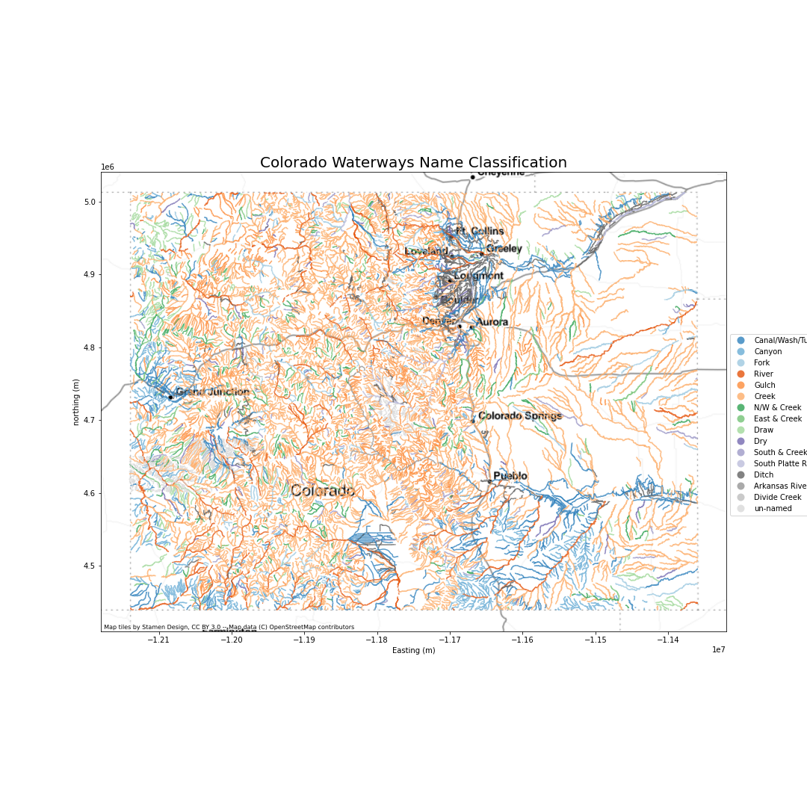

# 30daymapchallenge_21
Repository for my 2021 30 day map challenge code

### Day 1
  

---

### Day 2

---

### Day 3

---

### Day 4

---

### Day 5

---

### Day 6

---

### Day 7

---

### Day 8

---

### Day 9

---

### Day 10

---

### Day 11

---

### Day 12

---
### Day 13

---
### Day 14

---
### Day 15

---
### Day 16

---
### Day 17

---
### Day 18

---
### Day 19

---
### Day 20

---

